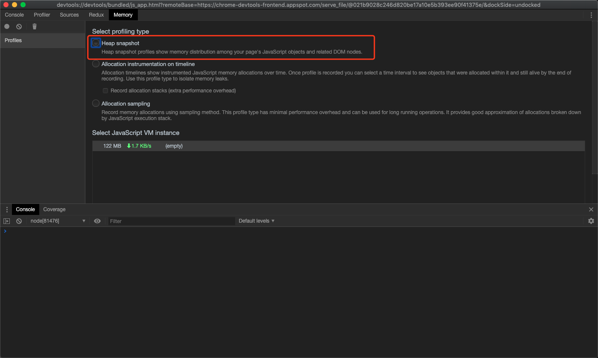
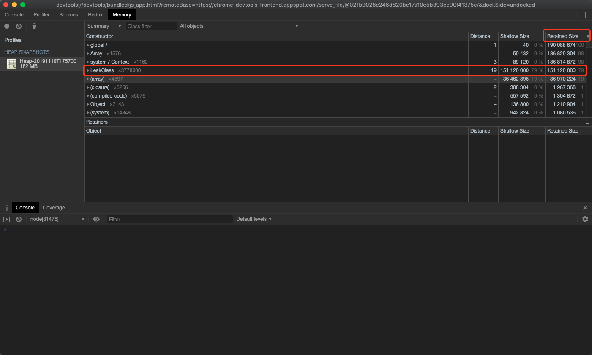
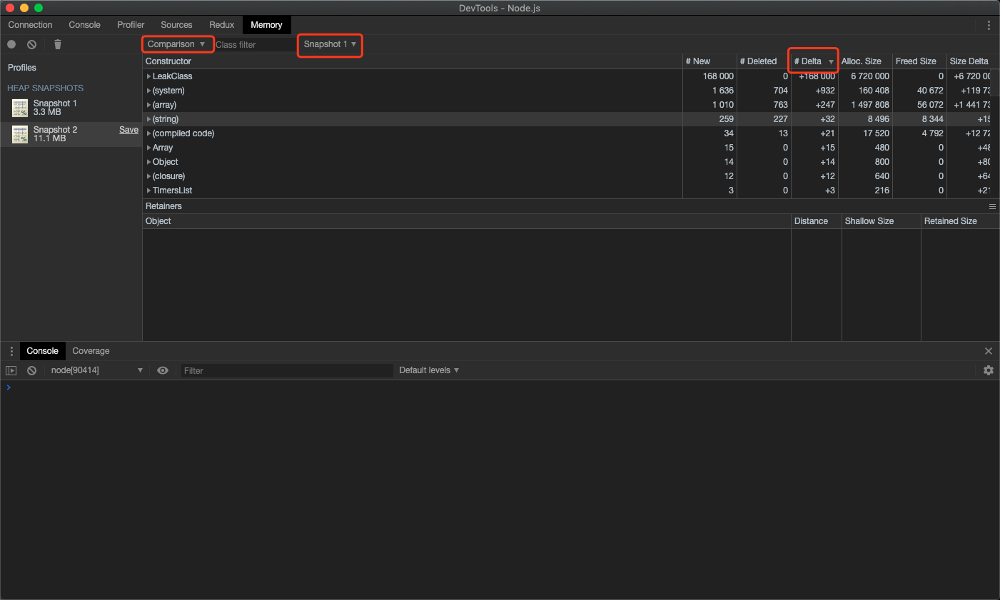
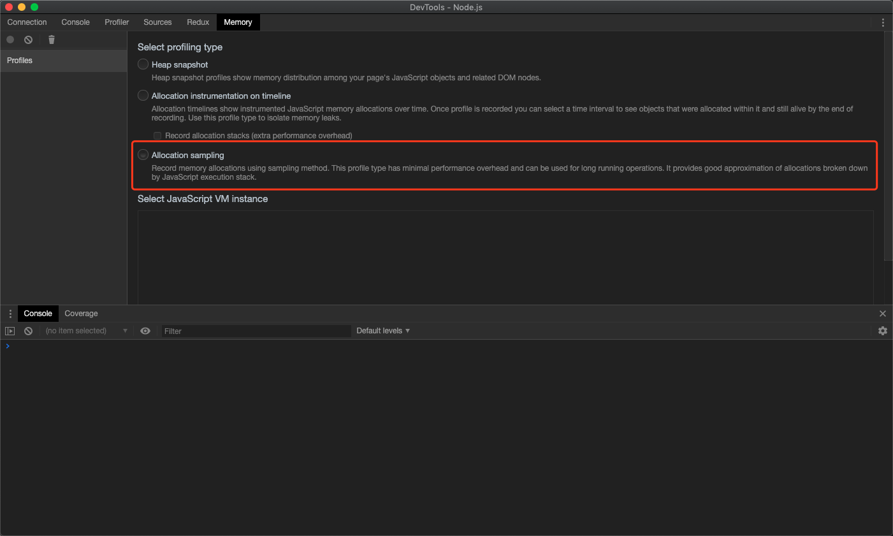
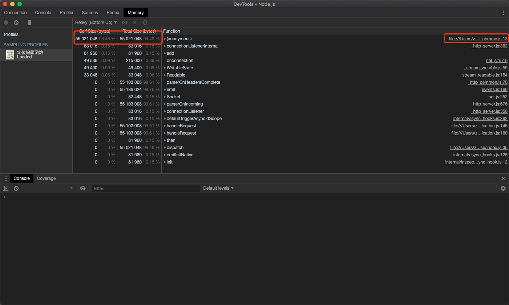
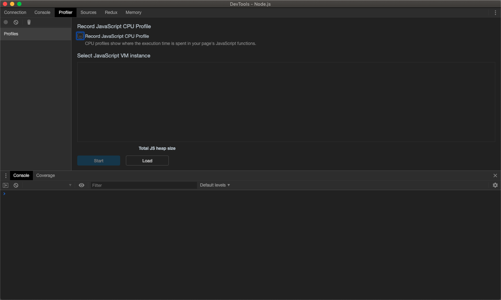
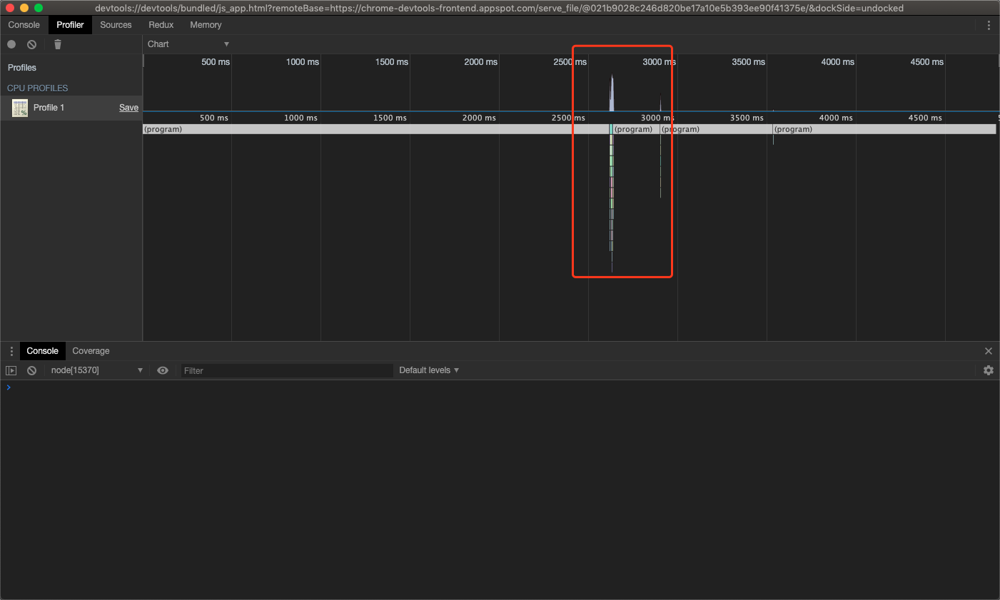
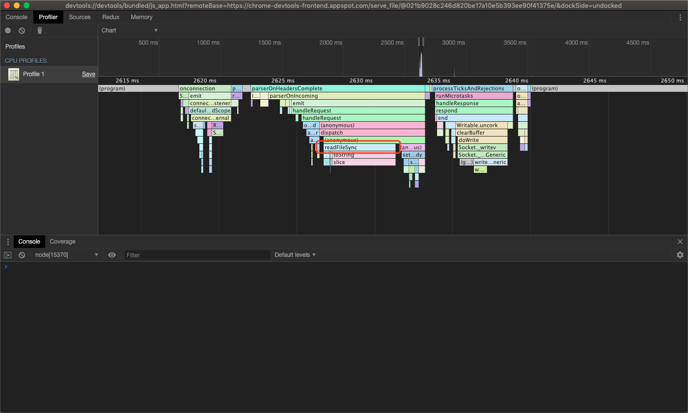
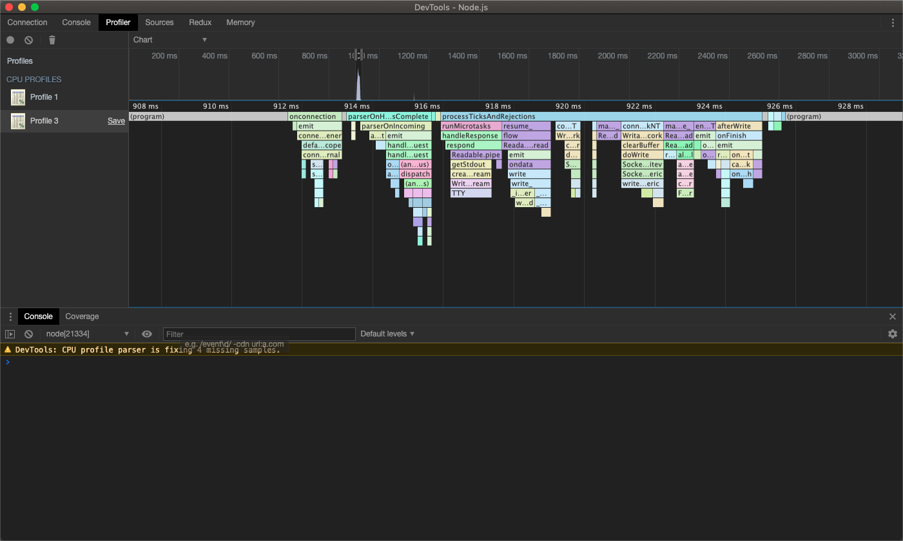

# nodejs 性能瓶颈监控实战

## 1. node.js 内存泄漏问题定位

首先，打开 Chrome Devtools 里的 Memory 面板，用以监控我们的程序内存使用情况。

调试方法：

* 以 inspect 方式启动 node 应用： `node --inspect-brk memory.js`
* 在 `chrome://inspect`中找到对应 node.js 应用并注入（inspect）调试工具
* 启动压测脚本： `while true;do curl localhost:3000;done` 或 `ab -c 100 -t 10 http://localhost:3000/`
* 到开发者工具中进行相关监测

### 1.1. 使用(HeapDump)堆快照发现已分离 DOM 

首先，选中 `Heap snapshot` 选项，在程序运行的任何时刻拍摄快照

按照`Retained Size`（分配得到的内存）排序，查找内存占有率较大的异常实例，即可定位到撑满内存的变量：

> 常用名词解释：
>
> * Shallow Size：指对象自身大小，不包括它引用的对象
> * Retained Size：指对象自身的大小和它引用的对象的总大小，即该对象被 GC 之后所能释放的内存空间

也可以拍摄多张快照，进行对比:

* 选中一个座位参照基准的 HeapShot
* 打开下拉菜单并选中`Comparison`
* 在选择一个进行对比的 snapshot
* 按`Delta`排序，即可知道变化最大的内存实例

### 1.2. 按函数执行产出调查内存分配

目前，我们已经知道了发生内存泄漏的对象实例，如何定位产生这些实例的具体代码呢？

首先，我们回到 Memory Tab 初始页，这回点选 `Allocation sampling`，启动应用并录制一段引发内存泄漏的内存录像

可以看到有一个匿名函数（anonymous）分配了大量的内存空间，而右边即是对应代码的位置，点击即可实时跳转

## 2. nodejs CPU 占用率过高问题定位

首先，打开 Chrome Devtools 里的 Profiler 面板，用以监控我们的程序执行时的 CPU 占用率。

我们都知道，nodejs 的 JS 执行是单线程的，所以如果有某项任务执行时间过长，就会阻塞 CPU，因此，我们需要找出那些执行代价昂贵的代码

调试方法：

* 以 inspect 方式启动 node 应用： `node --inspect-brk profile.js`
* 在 `chrome://inspect`中找到对应 node.js 应用并注入（inspect）调试工具
* 发送一次请求： `curl localhost:3000`
* 到开发者工具中进行相关监测

点击 `Start` 启动监测：

发送一次请求并 `Stop` 监测，选择 Chart 模式，观察火焰图，生成结果如下图所示：

可以看到，在 2500ms ~ 3000ms 时段，有一处 CPU 性能使用高峰，因此只需要定位到此处，就能发现性能瓶颈

放大该处高峰，即可看见清晰的火焰图：

> 火焰图怎么看？
>
> * 每一个长条，都表示一个函数的执行
> * y 轴表示调用栈，顶部就是正在执行的函数，上方即是它的父函数
> * x 轴表示函数的执行时长，条块越长，执行的时长越久，CPU 占用率也就越高
>
> 因此，需要寻找的，就是越靠近顶层，且长度越长的函数

这里，我们看到了一个熟悉的函数名 —— `readFileSync`，因此我们可以确定，本应用的性能瓶颈时出在这个函数上，因此，我们将其改造成异步任务，并转化成 ArrayBuffer

> 常见 nodejs 会出现 CPU 性能瓶颈的情况：
>
> * 正则匹配字符串的时长会随着字符串的长度增加呈现指数型上升
> * 高次数的循环容易产生 CPU 阻塞
> * 同步 io 容易拉低 CPU 性能，尽可能避免业务逻辑中的 require 或者一些 sync 方法的调用

最后，我们再次进行 profile 监控可以发现，函数的执行都变得比较平均了，不会有哪一个函数有特别长的执行时长

